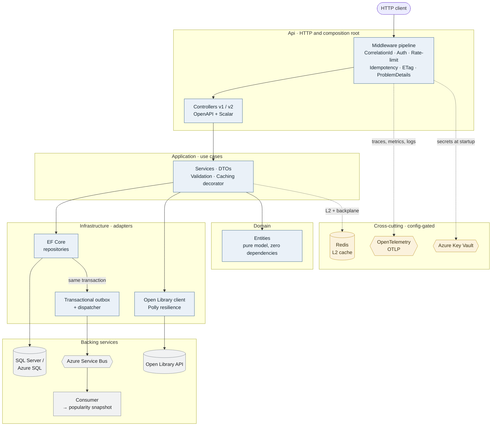

# WebApiPlayground

[](https://github.com/riccardodema/WebApiPlayground/actions/workflows/ci-cd.yml)
[](https://github.com/riccardodema/WebApiPlayground/actions/workflows/pr-validation.yml)


A deliberately small CRUD Web API (books/authors) whose point isn't the domain but the
**engineering around it** — the patterns a real .NET Web API needs in production: Clean
Architecture (layering enforced by tests), caching, idempotency, rate limiting, resilience,
observability and a transactional outbox, each implemented end-to-end and explained. Plus a
versioned database, a full test pyramid, and CI/CD on **both Azure DevOps and GitHub Actions**.

## A guided tour

The domain is trivial on purpose — books and authors, plain CRUD. Everything worth looking at is the
**production engineering wrapped around it**: the concerns a real .NET API faces once it leaves the demo
stage. The map below is the whole system on one screen; the sections after it go deep on each piece, and
the [decision records](docs/adr/) explain *why* every choice was made.

Two directions to keep in mind. **At runtime, a request flows outward** — through the HTTP pipeline, into
the use-case layer, out to the adapters (database, message broker, external APIs). **At build time,
dependencies point inward** — the Domain knows nothing about the web or the database — and that rule is
*enforced by a test*, not just written down.



<sub>Solid arrows: request / data flow · dotted: optional, config-gated.</sub>

**What one request actually touches.** A `GET /api/v1/books` gets a **correlation id** for tracing, is
**authenticated** (Entra ID JWT) and **rate-limited** per client; a strong **ETag** may short-circuit it
to `304`, otherwise it hits a **cached** service over an EF Core repository — all wrapped in
**OpenTelemetry** traces, metrics and logs. A `POST` adds **idempotency** (safe retries), **validation**,
**optimistic concurrency** (`If-Match` → 412/428), and writes the book *and* an **outbox** message in one
transaction; that message is later published to **Azure Service Bus** and consumed to enrich the book with
popularity data fetched from a **real external API** behind a **Polly** resilience pipeline. Any failure
returns as an **RFC 7807 ProblemDetails** carrying that same correlation id.

**What's around the code.** The database schema is **versioned as code** (DACPAC, the single source of
truth), the Azure infrastructure is **versioned as code** (Bicep), secrets load from **Key Vault**, the
app ships as a **hardened, non-root container**, and the **CI/CD pipeline is implemented twice** — once on
Azure DevOps, once on GitHub Actions. A full **test pyramid** (unit, integration via Testcontainers,
architecture via NetArchTest, IaC, Docker) is itself held honest by **mutation testing** and a
**coverage ratchet** — because green tests aren't evidence on their own.

> **Honest status.** Everything here runs locally and in CI against real dependencies or their **official
> emulators** (SQL Server, Service Bus, Key Vault). The live Azure deployment is fully authored and
> validated (Bicep + `what-if`, gated pipelines) but **not yet applied to a real subscription** — and the
> docs say so wherever it's relevant, never more than is true.

**Where to look next:** the per-capability sections below go deep on each piece; the
[Architecture Decision Records](docs/adr/) are the short version of the reasoning behind them.

## Architecture

Clean Architecture, dependencies point inwards (outer layers depend on inner, never the reverse):

```
┌─────────────────────────────────────────────────────────┐
│  Api            Controllers · Middleware · OpenAPI        │  ← HTTP, DI composition root
│  ─ depends on ─▶ Application                               │
│      Application   Services · DTOs · Interfaces           │  ← use cases, no infra detail
│      ─ depends on ─▶ Domain                                │
│          Domain        Entities                            │  ← pure model, zero dependencies
│  Infrastructure  EF Core DbContext · Repositories         │  ← implements Application interfaces
└─────────────────────────────────────────────────────────┘
```

| Pattern / practice | Where |
|---|---|
| Repository + Service layer | `Application/Services`, `Infrastructure/Repositories` |
| DTOs (no entity leakage over HTTP) | `Application/DTOs` |
| Dependency Injection per layer | `*/DependencyInjection.cs` (composed in `Api/Program.cs`) |
| Interface segregation (testable seams) | `Application/Interfaces` (`IBookRepository`, `IBooksService`) |
| Structured logging + correlation id | Serilog + `Api/Middleware/CorrelationIdMiddleware` |
| RFC 7807 error responses (ProblemDetails) | `Api/ErrorHandling/GlobalExceptionHandler` |
| Liveness / readiness health probes | `Api/HealthChecks` (`/health/live`, `/health/ready`) |
| Rate limiting (sliding window, per-client) | `Api/RateLimiting`, `Api/Extensions/RateLimitingExtensions` |
| API versioning (URL segment, doc per version) | `Api/Versioning`, `Api/Extensions/ApiVersioningExtensions` |
| Optimistic concurrency (rowversion → ETag/`If-Match`, 412/428) | `Api/Http/ETagResultFilter`, `Infrastructure/Repositories/BookRepository` |
| Observability (OpenTelemetry: traces + metrics + logs via OTLP) | `Api/Extensions/OpenTelemetryExtensions`, `Application/Diagnostics/BooksDiagnostics` |
| Resilience (Polly v8: retry + circuit breaker + timeout on an external dependency, 503 fail-fast) | `Infrastructure/Popularity/BookPopularityRegistration`, `Api/ErrorHandling/ExternalServiceUnavailableExceptionHandler` |

## Stack

- **.NET 10** Web API · **EF Core 10** (SQL Server / Azure SQL)
- **Scalar** for OpenAPI UI (Swashbuckle is incompatible with .NET 10)
- **Serilog** structured logging
- **HybridCache via FusionCache** (Redis-ready) + **HTTP caching (ETag)**
- **Native .NET rate limiting** (`System.Threading.RateLimiting`, sliding window)
- **Asp.Versioning** for API versioning (URL segment, OpenAPI document per version)
- **Optimistic concurrency** (EF Core `rowversion` → ETag / `If-Match`, 412/428)
- **OpenTelemetry** (traces + metrics + logs over OTLP; Serilog → OTLP log bridge)
- **HTTP resilience** (`Microsoft.Extensions.Http.Resilience` / **Polly v8** — retry, circuit breaker, timeout on an external dependency)
- **xUnit · Moq · Testcontainers.MsSql** for testing
- **SQL Database Project (DACPAC)** for the database schema

## Caching

Two complementary layers cut the cost of repeated `GET`s — a request that would otherwise re-run a
DB query, re-map, re-serialize and re-transfer identical bytes:

- **Server-side — `HybridCache` via FusionCache.** The data layer is cached: an L1 in-memory tier
  serves hits in **microseconds** instead of hitting SQL Server, with **stampede protection** (a
  burst on an expired key triggers a single DB load, not a thundering herd) and **fail-safe** (serve
  the last good value if the DB is momentarily down). The app depends only on the standard `HybridCache`
  abstraction; FusionCache is the implementation, wired in the composition root.
- **HTTP caching — ETag + `Cache-Control`.** Each `GET` carries a strong `ETag`; a follow-up request
  with `If-None-Match` gets a **`304 Not Modified` with no body**, saving bandwidth and client work.
- **Cache invalidation** is tag-based: every write (`POST`/`PUT`/`DELETE`) invalidates the `books`
  tag in one call, dropping both single-book and list-page entries — no stale reads.
- **Multi-instance ready.** Setting a Redis connection string activates an **L2 (Redis)** shared tier
  plus a **backplane**: when one instance invalidates an entry, the backplane notifies all the others
  to drop it from their L1, keeping the cache **coherent across instances** — config-only, no code
  change. Empty connection string ⇒ memory-only.

Details and the speed/latency rationale: [`.claude/context/caching.md`](.claude/context/caching.md).

## Idempotency

`POST` is not idempotent: if the response to a create is lost (timeout, dropped connection, an HTTP
client that auto-retries, a double click), the client retries and a **duplicate** resource is created.
A client supplies a unique `Idempotency-Key` header; the first request is executed and its response
stored, and any retry with the same key **replays that stored response** without re-running the write
— an **exactly-once** effect on writes.

- **No duplicates on retry**, and the retry gets the *same* response verbatim (status, `Location`,
  body), marked with `Idempotency-Replayed: true`.
- **Key reuse is caught**: the same key with a *different* payload returns **422**, instead of silently
  replaying the wrong response.
- **Stored outcomes are deterministic** (2xx–4xx); 5xx is never stored so transient failures stay
  retriable.
- **Multi-instance ready**: the store is an `IDistributedCache` (in-memory now, Redis when a connection
  string is configured), so the key works across instances — config-only.

The de-facto standard pattern (Stripe, PayPal, IETF draft). Implemented as a middleware on POSTs;
opt-in via the header. Details: [`.claude/context/idempotency.md`](.claude/context/idempotency.md).

## Rate limiting

An exposed API has to survive abuse: one client hammering it (scraping, a retry storm, a bug) can
starve everyone else, saturate the database and inflate cost. The **native .NET rate limiter**
(`AddRateLimiter`/`UseRateLimiter`, in the shared framework — no extra package) caps how fast each
client can call, and beyond the cap answers **`429 Too Many Requests`** instead of doing the work.

- **Sliding window**, not fixed window. "N requests in the last 60s" — and unlike a fixed window it
  doesn't allow a **2× burst across the boundary** of two calendar windows. `QueueLimit = 0`, so an
  over-limit request is **rejected immediately** (deterministic backpressure, no hidden latency).
- **Per-client partitions.** The bucket key is the authenticated user (the same claim the idempotency
  key is scoped by), falling back to the IP for anonymous callers — so one noisy client can't eat
  everyone's quota, rather than a single global limit.
- **Read vs write, with reasoned limits.** Reads are generous (**100 / 60s** ≈ 1.6 req/s, well above
  any human-driven UI), writes are stricter (**20 / 60s**) because they mutate state, hit the DB and
  bust caches. They're **independent buckets** (exhausting writes doesn't block reads), applied with
  `[EnableRateLimiting("read"|"write")]`. Pairs with idempotency: a same-key retry storm is replayed
  by idempotency, a different-payload storm is capped here.
- **429 as RFC 7807 ProblemDetails**, same `correlationId`/`traceId` as every other error, plus a
  **`Retry-After`** header — and the `429` is **documented in the OpenAPI contract**, not implicit.
- **Per-instance** today (in-memory); a Redis-backed distributed limiter is the scale-out path, the
  same way caching and idempotency already gate Redis by config.

Limits are config-driven and read lazily at request time. Details:
[`.claude/context/rate-limiting.md`](.claude/context/rate-limiting.md).

## API versioning

An API with real clients can't change its contract freely: renaming a field, nesting an object or
dropping a property **breaks** existing callers. Versioning lets multiple contracts (`v1`, `v2`, …)
**coexist** on the same resource, so old clients stay on `v1` while new ones adopt `v2` — evolution
without a big-bang. Done with **Asp.Versioning** (the maintained successor of the old
`Mvc.Versioning`), **URL-segment** scheme:

- **Version in the URL** (`/api/v1/books`, `/api/v2/books`) — the most visible scheme: a recruiter
  sees it in Scalar, a client tries it from the browser, and it yields **one OpenAPI document per
  version** (a version selector in Scalar, `/openapi/v1.json` + `/openapi/v2.json`).
- **A worked v2**: the read representation evolves — the author goes from a flat string
  (`authorFullName`) to a **nested object** (`author: { id, fullName }`). That's a breaking response
  change, the textbook reason to version. The data fetch is shared with v1 (DRY); only the projection
  differs per version.
- **Writes are shared** across versions (the request contract is unchanged), so there's no duplicated
  write logic — one `BooksController` serves both, while a `BooksV2Controller` carries the evolved reads.
- **Discoverable & documented**: `ReportApiVersions` emits `api-supported-versions` /
  `api-deprecated-versions` on every response (documented in the OpenAPI contract), so a client learns
  which versions exist from any call. Deprecation + RFC 8594 `Sunset` are documented as the retirement
  path (not triggered here, since no version is retired).
- **Composes with everything**: each versioned operation keeps auth, rate limiting, idempotency, ETag
  caching and ProblemDetails — the OpenAPI transformers are shared across version documents.

Details: [`.claude/context/api-versioning.md`](.claude/context/api-versioning.md).

## Optimistic concurrency

Two clients read the same book and `PUT`/`DELETE` it almost simultaneously: without protection the
second write silently overwrites the first — a **lost update**. Even on a single instance, concurrent
users make this real. Optimistic concurrency locks nobody (no pessimistic locks, a poor fit for
stateless HTTP): each resource carries a **version**, and a write only proceeds if the version the
client expects is still current.

- **`rowversion` as the token.** SQL Server auto-bumps a `rowversion` column on every UPDATE — no
  app code. EF Core maps it with `.IsRowVersion()` as a **concurrency token**, so the `UPDATE`/`DELETE`
  becomes conditional (`WHERE Id=@id AND RowVersion=@expected`); 0 rows affected ⇒
  `DbUpdateConcurrencyException`.
- **Exposed as an ETag, validated with `If-Match`.** It **reuses the existing ETag infrastructure**:
  a single book's ETag is now the *version token* (not a representation hash), so one header serves both
  conditional caching (`304`) and concurrency. Writes **require** `If-Match` — missing ⇒
  **`428 Precondition Required`**, stale ⇒ **`412 Precondition Failed`** — and a successful write returns
  the new ETag, so a client can chain updates without a re-`GET`.
- **Errors as ProblemDetails** (RFC 7807) with the same `correlationId`/`traceId` as everything else, and
  the **`If-Match`/412/428 contract is documented in OpenAPI**, not implicit. Applies to both `PUT` and
  `DELETE`, across v1 and v2 (writes are shared).

Details and the conscious cache-L2 caveat:
[`.claude/context/optimistic-concurrency.md`](.claude/context/optimistic-concurrency.md).

## Observability

Structured logs and a per-request correlation id already exist — but there were no **distributed traces**,
no **metrics**, and no **vendor-neutral** channel to an observability backend. **OpenTelemetry** (the CNCF
standard) emits the three signals through one API and exports them over **OTLP** to *any* backend (Jaeger,
Tempo, Prometheus, the Aspire Dashboard, Datadog, App Insights…) without coupling the code to a vendor.

- **Traces** — a request becomes a *waterfall* of spans (incoming HTTP → service → SQL query): you see
  *where* the time goes and *what* a single request did, end to end.
- **Metrics** — aggregate time series (request rate, latency, error rate, GC, the rate limiter's queues):
  ASP.NET Core, EF Core and the runtime emit them "for free".
- **Logs** — the existing Serilog logs, now **correlated to the trace**: each log inside a span carries
  `TraceId`/`SpanId`, so you jump from a log to the full trace and back.
- **Closes the correlation loop** already started with the correlation id: `CorrelationId` (client header) ↔
  `TraceId` (W3C, cross-service) ↔ the `traceId` already present in every ProblemDetails error.

How it's built (2026 best practices):

- **SDK only at the composition root.** Business code is instrumented with **BCL primitives**
  (`ActivitySource`/`Meter`) in the Application layer; the OTel SDK and exporters live **only** in the Api —
  so the layering rules (auto-validated by NetArchTest) stay intact. A custom span `Books.Create` and a
  `books.created` metric showcase manual instrumentation alongside the framework's auto-instrumentation.
- **Config-gated export**, like Redis caching: empty `OtlpEndpoint` ⇒ telemetry is collected but not
  exported (negligible cost); set it ⇒ OTLP export of traces + metrics + logs. `ConsoleExporter=true` prints
  telemetry locally without a collector.
- **Logs via a Serilog → OTLP bridge** (`Serilog.Sinks.OpenTelemetry`): the sink re-attaches `TraceId`/`SpanId`
  and carries the `CorrelationId` along; the console sink is unchanged.
- **Free framework metrics**, including the **rate limiter** meter (active leases, queues, rejections).

View it locally with the one-container **.NET Aspire Dashboard**
(`docker run … mcr.microsoft.com/dotnet/aspire-dashboard`, OTLP on `:4317`). Details:
[`.claude/context/opentelemetry.md`](.claude/context/opentelemetry.md).

## Resilience

The moment an API calls **another service**, that service's latency and failures become *yours*: a slow or
flapping dependency can hang your threads, exhaust your connection pool and cascade into an outage — even
though *your* code is fine. A new endpoint **`GET /api/v1/books/{id}/popularity`** enriches a book with
popularity signals from a real external dependency (**[Open Library](https://openlibrary.org)** — ratings +
reading-log counts, the best *free* proxy for demand; real sales data isn't public), wrapped in a **Polly v8**
resilience pipeline (`Microsoft.Extensions.Http.Resilience`).

- **An explicit pipeline, not a black box.** Composed by hand so every strategy is visible and tunable,
  in the order that matters — **total timeout → retry → circuit breaker → per-attempt timeout** (outer→inner):
  - **Retry** with **exponential backoff + jitter**, on **transient** failures only (5xx/408/429/network/timeout).
    **4xx are never retried** (pointless and harmful); the jitter avoids a synchronized **retry storm**. Safe
    here because the call is an idempotent `GET`.
  - **Circuit breaker** — when the dependency is down, the breaker **opens** and **fails fast** without touching
    the network, protecting *us* (no threads parked on a dead service) *and them* (room to recover), then probes
    via half-open.
  - **Timeouts** at two levels: a **per-attempt** timeout cuts a single slow call so retry can step in, and a
    **total** timeout caps the whole retry sequence so the caller never waits unbounded.
- **Graceful degradation, not a 500.** When resilience is exhausted (circuit open, retries spent, timeout), the
  transport/Polly exception is translated to a domain `ExternalServiceUnavailableException` (it never leaks past
  Infrastructure) and mapped to **`503 Service Unavailable`** as RFC 7807 ProblemDetails with a **`Retry-After`**
  header and the same `correlationId`/`traceId` as every other error — and the `503` is **documented in the
  OpenAPI contract**, not implicit.
- **Cached, with degrade-to-stale.** The external response is cached (it's slow-moving, and the dependency is a
  free shared service): a hit skips the network *and* the breaker, a burst collapses to a single upstream call
  (stampede protection), and — the synergy — when Open Library is **down**, **fail-safe** serves the last good
  value instead of a 503. This needs cache options the `HybridCache` abstraction can't express (infinite factory
  timeouts so the resilience pipeline owns the timeout budget, not the 2s tuned for fast DB calls; an extended
  fail-safe window), so the popularity cache uses `IFusionCache` in Infrastructure — a conscious asymmetry vs the
  in-process `HybridCache` book cache.
- **Clean layering, enforced.** Only the abstraction `IBookPopularityClient` lives in Application; the typed
  `HttpClient` and the Polly pipeline live in Infrastructure — a **NetArchTest rule** fails the build if Polly or
  `Microsoft.Extensions.Http` ever leak upward, exactly like the cache abstraction.
- **Security-minded**: the host is fixed config (no SSRF — user input is only URL-encoded query string), the
  dependency is key-less (no secrets), timeouts/breaker are an **availability defense**, and upstream errors are
  never echoed to the client. Config-driven and read lazily at request time.

Details and the strategy trade-offs: [`.claude/context/resilience.md`](.claude/context/resilience.md).

## Asynchronous processing / Background jobs

Some work doesn't belong on the request thread. Calling **Open Library** to compute a book's popularity is slow
and depends on a third party — making the *writer* of a book wait for it is wrong. So writes **enqueue** the work
and return immediately; an in-process **`BackgroundService`** does it off the hot path. This is the classic
**producer/consumer over `System.Threading.Channels`**, with **backpressure**.

- **Event-driven, off the write path.** `POST/PUT /books` enqueues a `PopularityEnrichmentRequest` (best-effort,
  non-blocking) onto a **bounded `Channel`**; the consumer calls the **existing** resilient+cached
  `IBookPopularityClient` (which warms the `(title,author)` cache so the first read is hot) and **persists a
  durable snapshot**. The write never blocks on Open Library.
- **Reads stay fresh without a scheduler.** The read path is unchanged in the happy case — **cache → live on
  miss** (no preemptive stale, no stale-while-revalidate). There is **no periodic refresh** (we don't hammer a
  free third party across the whole catalog): a book read today has a long-expired cache entry → cache miss →
  **fresh live fetch**, never the popularity from when it was inserted. The durable **snapshot** is consulted on a
  read **only as an outage fallback** — when the dependency is down *and* the cache fail-safe is empty (e.g. cold
  cache after a restart) — serving last-known-good instead of a `503`.
- **A reusable worker that owns the pitfalls.** `BackgroundQueueWorker<T>` concentrates, in one tested place, the
  three things that bite: **exception isolation** (an unhandled throw in `ExecuteAsync` stops the whole host in
  .NET 6+ — here a poison item is logged/counted and the loop continues), a **DI scope per item** (no captive
  `DbContext`), and **graceful shutdown**.
- **Clean layering, enforced.** Only the abstraction `IBackgroundTaskQueue<T>` (pure BCL) lives in Application;
  the `Channel` and the `BackgroundService` live in Infrastructure — a **NetArchTest rule** fails the build if
  `Microsoft.Extensions.Hosting` or `System.Threading.Channels` ever leak into Application, like cache and resilience.
- **Observable, correlated.** The processing span attaches to the originating request's trace (across the async
  boundary), and `background.tasks.{enqueued,dropped,processed,failed}` counters surface the queue's behaviour.
- **Honest about its limits → next step.** The queue is in-memory and the enqueue isn't transactional with the DB
  write: items in the queue are lost on a crash and a full queue drops (**at-most-once**). That's acceptable here
  (normal reads are fresh; the snapshot is only an outage fallback) — and it's exactly what the **transactional
  outbox + Azure Service Bus** (next section) fixes, reusing the same enricher.

Details: [`.claude/context/background-processing.md`](.claude/context/background-processing.md).

## Transactional outbox + Azure Service Bus

The weakness above — an enqueue that isn't transactional with the write — is fixed the canonical way: a
**transactional outbox** with a **broker** (Azure Service Bus). The most "distributed systems" piece of the project.

- **Atomic by construction.** `POST/PUT /books` writes the book **and** an `OutboxMessages` row in the *same* EF
  transaction (explicit transaction; the `IDENTITY` key forces materializing the event *after* the first
  `SaveChanges`, then commit both). Crash before commit → both roll back. No event is ever produced for a write
  that didn't happen, and vice versa — **at-least-once, durable**.
- **The broker is the real transport.** A polling `OutboxDispatcher` reads unprocessed rows and **publishes** them
  through `IIntegrationEventPublisher`; a **decoupled consumer** receives from the queue and enriches. `ProcessedAt`
  is set when the **broker durably accepts** the message (the outbox hands off to the broker; the broker guarantees
  delivery to the consumer). Manual settlement: `Complete` on success, `Abandon` → redelivery → dead-letter for
  poison messages. The consumer is **idempotent** (snapshot upsert is 1:1 with the book), so redelivery is safe.
- **One transport seam, config-gated.** `IIntegrationEventPublisher` lives in Application (pure BCL); the Service
  Bus SDK and the consumer live in Infrastructure (a **NetArchTest rule** keeps `Azure.Messaging` out of
  Application). Azure Service Bus is the **real** path — it runs in `docker compose` (via the official **emulator**)
  and in Production (managed identity, **no SAS**) — with an in-process fallback only for a bare offline `dotnet run`.
- **Correlated past the broker.** The `traceparent` travels in the event, so the consumer's enrich span attaches to
  the originating write's trace — across the durable boundary *and* across the broker.
- **Verified end-to-end without an Azure account.** A dedicated integration test runs the real publish→consume→enrich
  flow against the **Service Bus emulator** (Testcontainers), and `docker compose up` exercises the same flow live.
  The **Bicep module** (`servicebus.bicep`: AAD-only, RBAC Sender+Receiver on the queue) is authored and validated
  with `bicep build` + IaC tests — but not yet deployed/`what-if`'d (pending an Azure subscription).

Details: [`.claude/context/outbox.md`](.claude/context/outbox.md).

## Database as code

The schema is **versioned in the solution** as a SQL Database Project
([`database/`](database/), SDK `Microsoft.Build.Sql`) — declarative `CREATE` per object,
built into a **DACPAC** and deployed with **SqlPackage** (computes the diff, no hand-written
ALTERs). The EF Core model is mapped 1:1 to it, and an idempotent post-deployment script
seeds reference data. See [database/README.md](database/README.md).

```bash
dotnet build database/WebApiPlayground.Database.sqlproj -c Release   # → .dacpac
DB_CONNECTION='...' ./database/deploy.sh                             # publish (or 'script' to review the diff)
```

## Infrastructure as code

Azure resources are **versioned in the repo** as [Bicep](https://learn.microsoft.com/azure/azure-resource-manager/bicep/)
([`infra/`](infra/)) — declarative, **idempotent** (re-applying the same state is a no-op),
with **what-if** as a mandatory preview and automated tests (Bicep build/lint, **xUnit** unit
tests over the compiled ARM, and **PSRule for Azure**). The foundation is an **Azure Key Vault** (RBAC auth, soft-delete, purge protection in
prod) where the DB connection string lives in production — created by IaC, with the secret
*value* set outside it (`./infra/set-secrets.sh`) so no secret ever flows through ARM deployments;
the app reads it at startup via the [Key Vault config provider](docs/keyvault.md). See
[infra/README.md](infra/README.md).

```bash
AZURE_SUBSCRIPTION_ID='...' ./infra/deploy.sh          # what-if (preview the diff)
AZURE_SUBSCRIPTION_ID='...' ./infra/deploy.sh deploy   # apply (idempotent)
```

CI/CD on both platforms ([`.github/workflows/infra.yml`](.github/workflows/infra.yml) ·
[`.azure/pipelines/infra.yml`](.azure/pipelines/infra.yml)): validate on PR, what-if → deploy on
`main` gated by the `production` environment. Same *disabled-until-configured* pattern as the app
deploy — the deploy job is skipped (not failed) until `AZURE_LOCATION` is set.

## Containerization

Until now Docker was used **only for tests** (Testcontainers spins up an ephemeral SQL Server *for the
test process* — the app itself runs in-process). A **`Dockerfile`** and **`docker-compose`** add the two
missing pieces: the app as a **portable, reproducible artifact**, and the **whole runtime stack in one
command**. They're complementary to Testcontainers, which stays exactly as it is — the Dockerfile doesn't
change how tests run.

- **Multi-stage image, chiseled & non-root.** Build on the .NET 10 SDK image (csproj copied first so the
  NuGet `restore` layer stays cached), run on **`aspnet:10.0-noble-chiseled-extra`** — a distroless-style
  image with **no shell/package manager**, running as the **non-root `app`** user on port **8080**. Smaller
  attack surface, faster pulls. (No curl-based `HEALTHCHECK`: chiseled has no shell, so liveness is an
  external HTTP probe.) The `-extra` variant bundles **ICU** — required because `Microsoft.Data.SqlClient`
  doesn't support .NET's Globalization Invariant Mode (the plain chiseled image starts but every DB query
  fails).
- **`docker compose up` = full local stack.** API + **SQL Server** + the **schema published from the DACPAC**
  (a one-shot `db-migrations` service that reuses the same `deploy.sh` as CI — "DACPAC is the source of
  truth") + the **official Azure Service Bus emulator** + a **Key Vault emulator** — wired with health checks
  and ordered startup. No local SQL Server install, no manual connection string — the onboarding is genuinely
  one command. With the emulators in the stack, the **transactional outbox runs over the real broker** locally
  (publisher → queue → decoupled consumer → popularity snapshot) and the **secrets come from the vault**
  (no connection strings in the api environment — see [Secrets](#secrets--azure-key-vault-config-provider)).
  Optional **Redis** (L2 cache + backplane) and **Aspire Dashboard** (OTLP telemetry) are off by default
  behind compose override files.
- **What it gives over Testcontainers**: a deploy-ready artifact (same image dev → CI → prod, the base for
  App Service for Containers / Kubernetes / Container Apps), and a way to exercise the **real** app against
  real dependencies — not the test stubs (auth, Open Library) — clicking through Scalar against a live stack.
- **Explicit fail-fast on config.** Outside Development the app **refuses to start** if mandatory settings are
  missing, listing **exactly** which ones (and their env-var form) — `ConnectionStrings:Default`,
  `AzureAd:ClientId/TenantId/Audience`, `ServiceBus:FullyQualifiedNamespace` (the broker is the real outbox
  transport in Production) — and pointing out that secrets can also come from **Key Vault** (`KeyVault__Uri`).
  The startup exit code is **non-zero on refusal**, so orchestrators and CI actually notice. Locally compose
  runs in Development, so the dev auth bypass + Scalar work with zero config; the image defaults to
  Production (12-factor).
- **Tested as code.** `tests/WebApiPlayground.DockerTests` holds static **contract tests** (non-root chiseled
  base, no plaintext secrets, port 8080, health check, migrations-before-api — fast, no Docker) plus a **live
  smoke test** that builds the image, starts the container and asserts `GET /health/live` — which doubles as
  `docker build` validation in CI.

```bash
cp .env.example .env                 # set MSSQL_SA_PASSWORD
docker compose up --build            # API + SQL + schema → http://localhost:8080/scalar/v1
docker compose -f docker-compose.yml -f docker-compose.aspire.yml up   # + OTLP dashboard (:18888)
```

> On Apple Silicon (arm64) the SQL Server and Service Bus emulator images run under emulation (`platform: linux/amd64`).

Details and the Testcontainers-vs-image-vs-compose distinction: [`.claude/context/docker.md`](.claude/context/docker.md).

## Secrets — Azure Key Vault config provider

Secrets (the DB connection string, and locally the Service Bus emulator one) are loaded **from Azure
Key Vault at startup** via the official configuration provider — **config-gated** on `KeyVault:Uri`
(empty = off, like Redis/OTLP/Service Bus). The provider is added **last** (vault values win over
appsettings/env vars) and **before** the startup fail-fast (vault secrets satisfy the validator).

- **Secretless first, vault for the rest.** Service Bus stays secretless (managed identity + namespace
  FQDN); `AzureAd` values are identifiers, not secrets — only *real* secrets go in the vault
  (`ConnectionStrings--Default`; `--` maps to `:` in .NET configuration).
- **Explicit credentials per environment** (no `DefaultAzureCredential` chain): `ManagedIdentity`
  (default, user-assigned supported), `AzureCli` (local runs against the real vault), `Emulator`
  (**Development only**, enforced with a talking error).
- **Talking fail-fast.** If the vault is configured but unreachable/forbidden, the app refuses to start
  and the fatal log says *where* it pointed, *which* credential, the *probable causes* (missing
  `Key Vault Secrets User` RBAC role, firewall default-deny, no `az login`, …) and the remedy.
- **Local = emulator, real = same mechanics.** `docker compose up` runs the community
  [Azure Key Vault emulator](https://github.com/james-gould/azure-keyvault-emulator) (pinned image,
  one-shot TLS cert + REST seed jobs; no third-party NuGet, self-signed trust scoped to the dev client
  only). Against the real vault: `./infra/deploy.sh deploy` → `./infra/set-secrets.sh
  ConnectionStrings--Default` → set `KeyVault__Uri`. Integration tests boot the app with the connection
  string **only in the vault** (Testcontainers emulator) — switching to the real vault changes
  configuration, not code.

Full guide (why Key Vault, setup, troubleshooting): [`docs/keyvault.md`](docs/keyvault.md).

## Testing

- **Unit** — `tests/WebApiPlayground.Tests` (xUnit + Moq), services in isolation.
- **Integration** — `tests/WebApiPlayground.IntegrationTests`, real SQL Server spun up via
  **Testcontainers** (Docker), exercising the API end-to-end.
- **Architecture** — `tests/WebApiPlayground.ArchitectureTests` (**NetArchTest**), enforces the
  Clean Architecture layering rules at build time (e.g. Domain/Application must not reference
  EF Core or ASP.NET; lower layers must not depend on the API). Fast, no DB or Docker.
- **Infrastructure** — `tests/WebApiPlayground.IacTests`, compiles the Bicep to ARM and asserts
  the security posture / idempotency (no Azure or Docker; skipped if the Bicep CLI is absent).
- **Docker** — `tests/WebApiPlayground.DockerTests`, static contract tests over the Dockerfile/compose
  (fast, no Docker) plus a live smoke test that builds the image and hits `/health/live` (skipped if the
  Docker daemon is absent).

```bash
dotnet test
```

### Test *quality* — proving the tests themselves work

Green tests aren't evidence by themselves (this repo once had an e2e test passing on the wrong
transport — see lesson `[L25]`). Three mechanisms keep the suite honest:

- **Mutation testing** (**Stryker.NET**): mutates the production code and checks the tests *fail*.
  Incremental on every PR (changed files only, `--since`), full run **on demand** via the
  `mutation-full` workflow (deliberately no schedules) — HTML report as artifact, self-hosted
  `mutation score` badge.
- **Coverage ratchet gate**: line+branch coverage (unit + integration, merged) is measured on every
  CI run and gated against [`tests/coverage-thresholds.json`](tests/coverage-thresholds.json) —
  thresholds start at the measured baseline and can only go *up*. Badges are self-hosted on the
  `badges` branch (no third-party coverage service).
- **Structural honesty tests**: the **DACPAC↔EF schema parity suite** boots the app against the
  schema actually deployed by the DACPAC (DacFx) and compares it column-by-column with the EF model —
  the rest of the suite uses `EnsureCreated`, which would hide drift. The **real-JWT suite** runs the
  production `JwtBearer`/Entra pipeline against an in-process **fake OIDC authority** (discovery +
  JWKS + RSA-signed tokens): signature, issuer, audience, lifetime and scope/role policies are all
  exercised with an exhaustive 401/403 matrix — none of which the test auth handler could ever prove.

## CI/CD — two implementations

The same pipeline is implemented twice to show portability across platforms:

| Stage | Azure DevOps ([`.azure/`](.azure/)) | GitHub Actions ([`.github/workflows/`](.github/workflows/)) |
|---|---|---|
| PR gate | `pr-validation.yml` | `pr-validation.yml` |
| Build + test (DRY) | `templates/` | reusable `build-test.yml` (`workflow_call`) |
| Release | `ci.yml` + `cd.yml` | `ci-cd.yml` |

Both: build the DACPAC, **publish the DB schema before deploying the app**, deploy to
Azure App Service, then **health-check** the `/health/ready` readiness probe. The deploy stage is gated by a
manual approval (Azure *Environment* / GitHub *Environment*), and GitHub Actions auth to
Azure uses **OIDC federated credentials** (no long-lived secrets). Setup details in
[.github/workflows/README.md](.github/workflows/README.md) and [.claude/context/cicd.md](.claude/context/cicd.md).

> Runnable on Azure free tier (App Service F1 + Azure SQL Database free, serverless with auto-pause).

## Run locally

Two ways: containerized (nothing to install but Docker) or with the .NET SDK against your own SQL Server.

### Option A — the whole stack with Docker Compose (recommended for a first run)

Everything runs in containers, so you **don't need .NET or SQL Server installed** — just **Docker Desktop**
(Compose v2 is bundled). Great for trying the API end to end on a fresh machine.

1. **Clone the repo**

   ```bash
   git clone https://github.com/riccardodema/WebApiPlayground.git
   cd WebApiPlayground
   ```

2. **Create your `.env`** — it holds the SQL Server `sa` password and is git-ignored (only `.env.example`
   is committed):

   ```bash
   cp .env.example .env
   ```

   Edit `MSSQL_SA_PASSWORD` if you want (it must be a *strong* password: 8+ chars, 3 of upper/lower/digit/
   symbol). If port **1433** is already used on your machine (a local SQL Server / Azure SQL Edge),
   uncomment `SQL_HOST_PORT=14330` in `.env`.

3. **Start it** (the first run pulls the SQL Server image and builds the app image — a few minutes; later
   runs are fast):

   ```bash
   docker compose up --build        # add -d to run in the background
   ```

   Compose starts SQL Server, **waits until it's healthy**, runs the one-shot **`db-migrations`** service
   that publishes the schema + seed data from the DACPAC, seeds the **Key Vault emulator** with the
   stack's secrets (one-shot `keyvault-certs` + `keyvault-seed` jobs — no connection strings in the api
   environment), **then** starts the API.

4. **Use it** — the API runs in **Development**, so the dev auth bypass is on (no token needed):

   - Scalar UI (try endpoints from the browser): <http://localhost:8080/scalar/v1>
   - Readiness probe (verifies DB connectivity): `curl http://localhost:8080/health/ready` → `200`
   - A real request: `curl "http://localhost:8080/api/v1/books"` → the seeded books

5. **Stop / reset**

   ```bash
   docker compose down       # stop & remove the containers (keeps the DB data volume)
   docker compose down -v    # also wipe the DB volume — clean slate next time
   ```

**Iterate while developing**

- After changing code, rebuild and restart: `docker compose up --build`.
- Follow logs: `docker compose logs -f api` (or `db`, `db-migrations`).
- Optional extras, off by default (compose override files):

  ```bash
  docker compose -f docker-compose.yml -f docker-compose.redis.yml  up   # Redis L2 cache + backplane
  docker compose -f docker-compose.yml -f docker-compose.aspire.yml up   # OTLP telemetry → http://localhost:18888
  ```

**Troubleshooting**

- *`port is already allocated` on 1433* — a local SQL Server is using it; set `SQL_HOST_PORT=14330` in `.env`
  (the API reaches the DB over the internal compose network, so this only changes the host-side port).
- *Apple Silicon (arm64)* — the SQL Server image is amd64-only and runs under emulation
  (`platform: linux/amd64`); the first start is a little slower. The Key Vault emulator has a native
  arm64 tag — see `.env.example`.
- *Running the image in Production* — it intentionally **fails fast** (non-zero exit) unless you pass
  the secrets (`ConnectionStrings__Default`, … or a `KeyVault__Uri` to load them from) and
  `AzureAd__ClientId/TenantId/Audience`, listing exactly what's missing.

### Option B — with the .NET SDK (your own SQL Server)

```bash
# DB connection goes in src/WebApiPlayground.Api/appsettings.Development.json (git-ignored)
dotnet run --project src/WebApiPlayground.Api/WebApiPlayground.Api.csproj
# Scalar UI:   http://localhost:5242/scalar/v1
# OpenAPI doc: http://localhost:5242/openapi/v1.json
```

From **VS Code press F5** (`Debug (http)`): it builds, runs and opens the browser on
`http://localhost:5242/scalar/v1` automatically (via the `serverReadyAction` in
[.vscode/launch.json](.vscode/launch.json)). Entra ID is optional locally — when `AzureAd` is
unconfigured the API runs with a development auth bypass (see [auth.md](.claude/context/auth.md)).

## Development workflow

`main` is protected: no direct pushes, changes land via pull request, and a PR can
only be merged after the **PR Validation** check (`validate / build-test`) is green
and the branch is up to date. History is kept linear (squash/rebase), force-pushes
and branch deletion are disabled.

The project also doubles as a proof-of-concept for an **AI-assisted workflow**: Claude as a
coding copilot wired into this real GitHub setup — MCP integrations (e.g. live SQL Server
access) on top of the same PR + CI/CD gates above — aiming for a loop that is fast yet safe
and detail-oriented (multi-step checks before any sensitive or irreversible action, no
secrets in the repo).

## Repository layout

```
src/
  WebApiPlayground.Domain          entities (no dependencies)
  WebApiPlayground.Application     services, DTOs, interfaces
  WebApiPlayground.Infrastructure  EF Core DbContext, repositories
  WebApiPlayground.Api             controllers, middleware, DI, OpenAPI
tests/
  WebApiPlayground.Tests           unit tests
  WebApiPlayground.ArchitectureTests NetArchTest layering rules (auto-validated architecture)
  WebApiPlayground.IntegrationTests Testcontainers-based integration tests
  WebApiPlayground.IacTests        Bicep→ARM infrastructure unit tests
  WebApiPlayground.DockerTests     Dockerfile/compose contract tests + live image smoke test
database/                          SQL project (DACPAC) — schema as code
infra/                             Bicep IaC (Azure Key Vault) — infra as code
.azure/ · .github/                 CI/CD on Azure DevOps and GitHub Actions
Dockerfile · docker-compose*.yml   container image + local runtime stack
```
